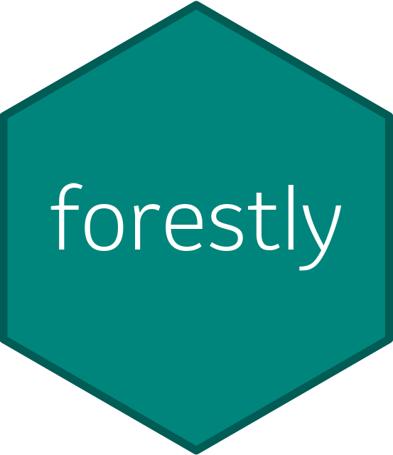

# forestly 

<!-- badges: start -->
[](https://github.com/Merck/forestly/actions/workflows/R-CMD-check.yaml)
<!-- badges: end -->

## Overview

The forestly package creates interactive forest plots for clinical trial analysis & reporting.

- Safety analysis
  - Specific adverse events analysis
- Efficacy analysis (future work)
  - Subgroup analysis

<video src="https://user-images.githubusercontent.com/85646030/238364424-b93e8b04-5791-4c24-90ea-cfb7832442db.mp4" data-canonical-src="https://user-images.githubusercontent.com/85646030/238364424-b93e8b04-5791-4c24-90ea-cfb7832442db.mp4" controls="controls" muted="muted" class="d-block rounded-bottom-2 width-fit" style="max-height:640px;max-width:60%;">

</video>

We assume ADaM datasets are ready for analysis and
leverage [metalite](https://merck.github.io/metalite/) data structure to define
inputs and outputs.

## Workflow

The general workflow is:

1. `meta_forestly()` constructs input metadata for treatment analysis from ADaM datasets.
1. `prepare_ae_forestly()` prepares datasets for interactive forest plot.
1. `format_ae_forestly()` formats output layout.
1. `ae_forestly()` generates an interactive forest plot.

Here is a quick example

```r
library("forestly")

meta_forestly(
  forestly_adsl,
  forestly_adae,
  population_term = "apat",
  observation_term = "wk12"
) |>
  prepare_ae_forestly(parameter = "any;rel;ser") |>
  format_ae_forestly() |>
  ae_forestly()
```

## Interactive features

The interactive features for safety analysis include:

- Select different AE criteria.
- Filter by incidence of AE in one or more groups.
- Reveal information by hovering the mouse over a data point.
- Search bars to find subjects with selected adverse events (AEs).
- Sort value by clicking the column header.
- Drill-down listing by clicking $\blacktriangleright$.

## References

- Paper: [2023 PHUSE US Connect](https://phuse.s3.eu-central-1.amazonaws.com/Archive/2023/Connect/US/Florida/PAP_DV07.pdf)
- Talk: [2021 R/Pharma Conference](https://rinpharma.com/publication/rinpharma_206/)
