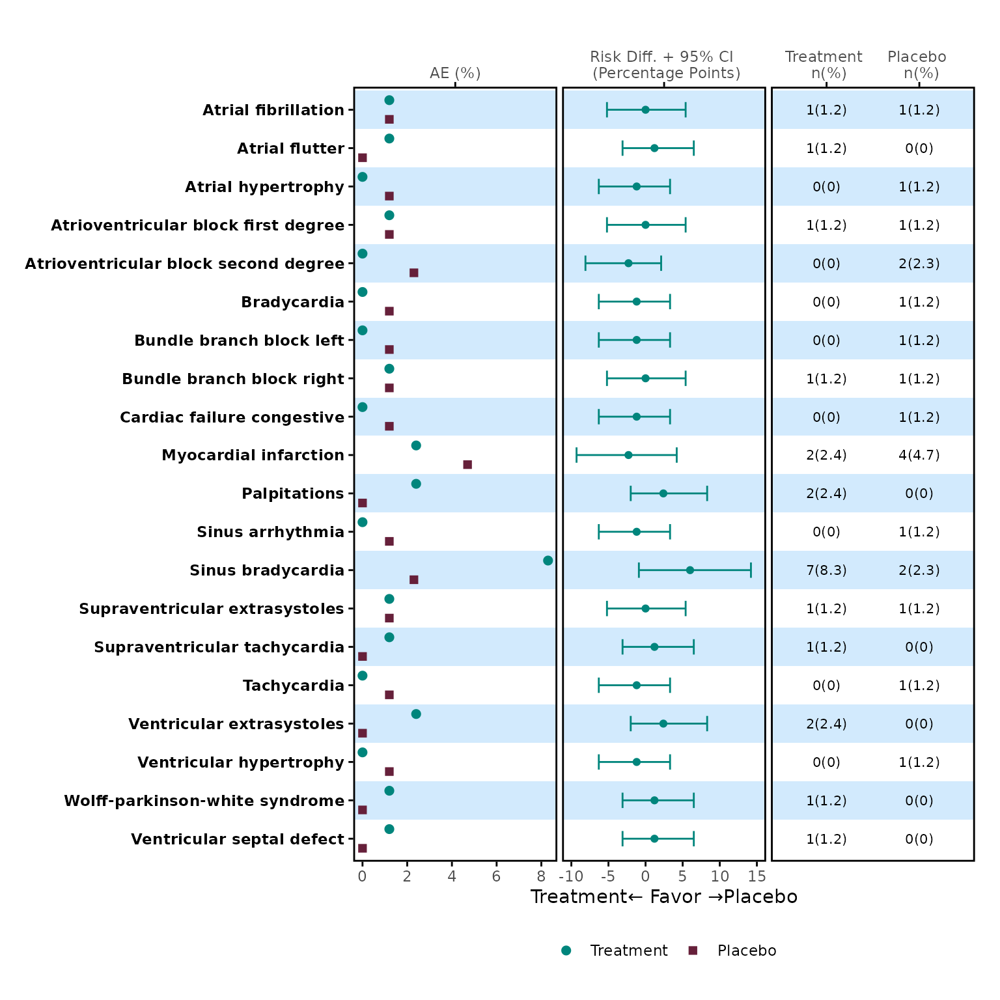

# Generate Static AE Forest Plots

``` r
library(forestly)
library(ggplot2)
```

``` r
forestly_adsl$TRTA <- factor(
  forestly_adsl$TRT01A,
  levels = c("Xanomeline Low Dose", "Placebo"),
  labels = c("Low Dose", "Placebo")
)

forestly_adae$TRTA <- factor(
  forestly_adae$TRTA,
  levels = c("Xanomeline Low Dose", "Placebo"),
  labels = c("Low Dose", "Placebo")
)

meta <- meta_forestly(
  dataset_adsl = forestly_adsl,
  dataset_adae = forestly_adae,
  population_term = "apat",
  observation_term = "wk12",
  parameter_term = "any;rel;ser"
) |>
  prepare_ae_forestly() |>
  format_ae_forestly()
```

``` r
meta_any <- meta$tbl[1:20, ] |> dplyr::filter(parameter == "any")
```

``` r
p1 <- meta_any |>
  dplyr::select(name, prop_1, prop_2) |>
  plot_dot(
    y_var = "name",
    label = c("Treatment", "Placebo")
  )
#> Warning: The `size` argument of `element_rect()` is deprecated as of ggplot2 3.4.0.
#> ℹ Please use the `linewidth` argument instead.
#> ℹ The deprecated feature was likely used in the forestly package.
#>   Please report the issue at <https://github.com/Merck/forestly/issues>.
#> This warning is displayed once every 8 hours.
#> Call `lifecycle::last_lifecycle_warnings()` to see where this warning was
#> generated.
p1
```


``` r
p2 <- meta_any |>
  dplyr::select(name, diff_1, lower_1, upper_1) |>
  plot_errorbar(
    y_var = "name",
    label = c("Treatment", "Placebo"),
    legend_nrow = NULL,
    theme = theme_panel(show_ticks = FALSE, show_text = FALSE)
  )
p2
```


``` r
meta_any$stat_1 <- paste0(meta_any$n_1, "(", meta_any$prop_1, ")")
meta_any$stat_2 <- paste0(meta_any$n_2, "(", meta_any$prop_2, ")")

p3 <- meta_any |>
  dplyr::select(name, stat_1, stat_2) |>
  table_panel(
    y_var = "name",
    theme = theme_panel(show_ticks = FALSE, show_text = FALSE),
    x_label = c("Treatment \n n(%)", "Placebo \n n(%)")
  )
p3
```


``` r
do.call(patchwork::wrap_plots, list(p1, p2, p3)) +
  # Define outer margin for assembled plot
  patchwork::plot_annotation(
    theme = theme(plot.margin = margin(1, 1, 1, 1, unit = "lines"))
  ) +
  patchwork::plot_layout(guides = "collect") & # Shared legend
  theme(legend.position = "bottom")
```


